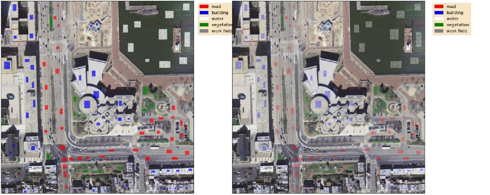
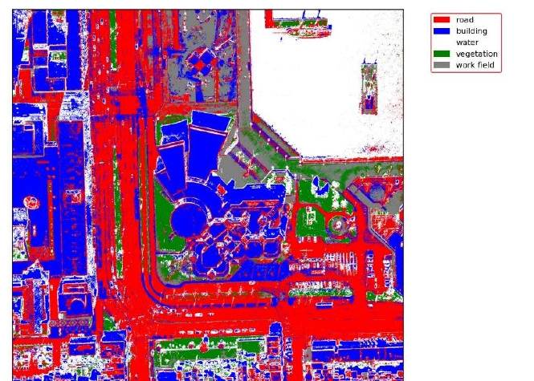
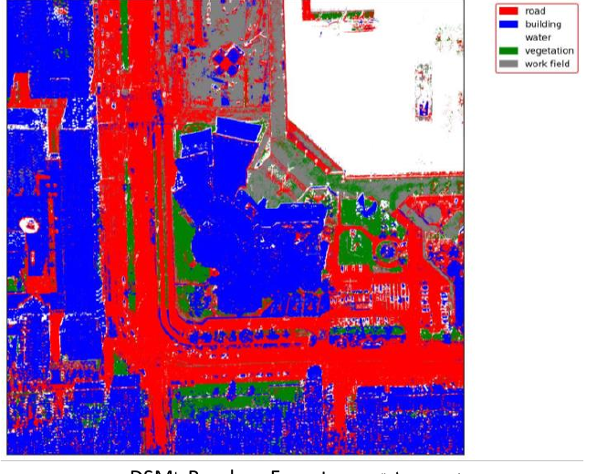
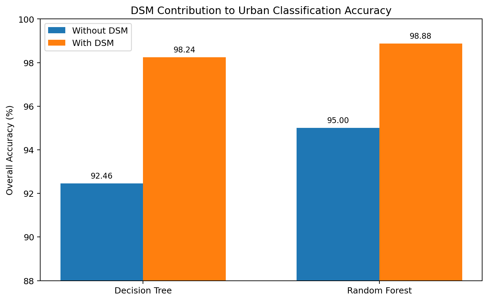
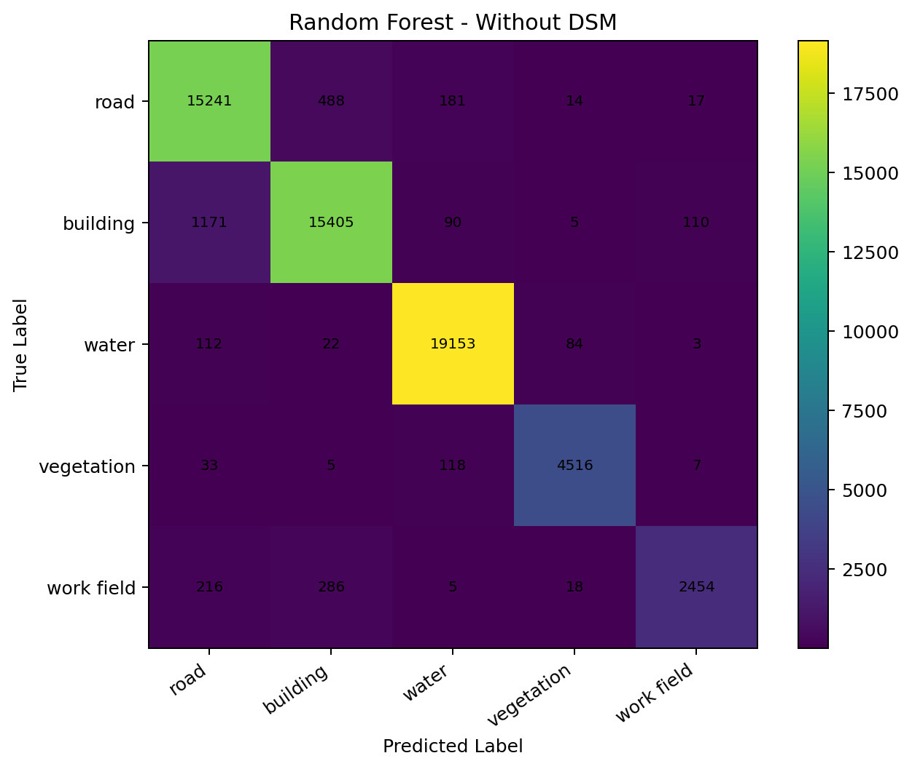
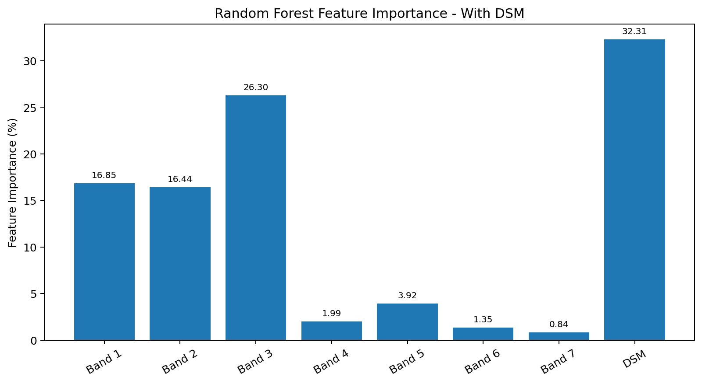
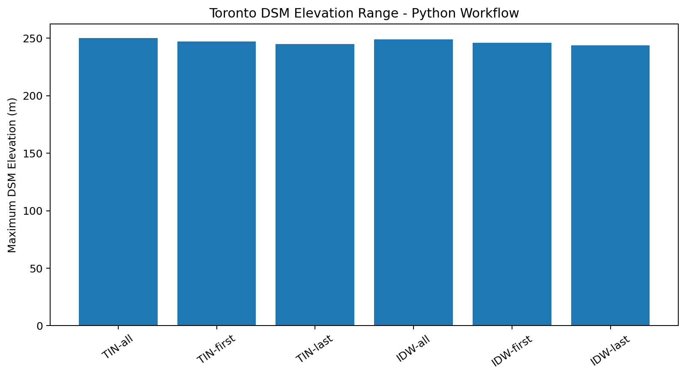

# LiDAR DSM-Assisted Urban Classification

A Python-based remote-sensing workflow for:

1. generating Digital Surface Models (DSMs) from LiDAR point clouds; and
2. evaluating how DSM elevation information improves supervised urban land-cover classification.

The final experiment compares **Decision Tree** and **Random Forest** models using:

- **7 bands without DSM**: RGB + texture features
- **8 bands with DSM**: RGB + texture features + elevation

The project originated from graduate coursework in **Advanced Laser Scanning: Processing and Applications** at K. N. Toosi University of Technology.

## Why This Project?

Urban classes can be spectrally or texturally similar while having very different elevations.

For example:

- roads and rooftops can have similar brightness;
- vegetation and some built surfaces can have complex texture;
- DSM elevation provides a geometric cue that can help separate these classes.

The documented experiment showed a clear improvement when DSM was added to the feature stack.

## Python Workflow

```text
LiDAR LAS/LAZ
    |
    +--> WhiteboxTools
    |      |- TIN DSM
    |      `- IDW DSM
    |          for first / last / all returns
    |
RGB + Texture Stack ----------+
                              |
DSM --------------------------+--> Feature Stack
                                   |
ROI Labels ----------------------->| Stratified Train/Test Split
                                   |
                                   +--> Decision Tree
                                   |
                                   `--> Random Forest
                                           |
                                           +--> Classification Map
                                           +--> Confusion Matrix
                                           +--> Accuracy / F1
                                           `--> Feature Importance
```

## Python Classification Samples

The same labeled ROI pixels were separated into training and test sets for model fitting and evaluation.



## Random Forest Classification

### Without DSM



### With DSM



The with-DSM result is visibly more spatially coherent in several urban regions and achieved the strongest documented accuracy.

## Documented Accuracy Results

| Model | Feature Stack | Overall Accuracy | Macro F1 | Weighted F1 |
| --- | --- | ---: | ---: | ---: |
| Decision Tree | Without DSM | 92.46% | 0.91 | 0.92 |
| Random Forest | Without DSM | 95.00% | 0.94 | 0.95 |
| Decision Tree | With DSM | 98.24% | 0.97 | 0.98 |
| Random Forest | With DSM | **98.88%** | **0.98** | **0.99** |



Documented improvement after adding DSM:

- **Decision Tree:** +5.78 percentage points
- **Random Forest:** +3.88 percentage points

## Confusion Matrices

### Random Forest - Without DSM



### Random Forest - With DSM


The documented Random Forest confusion matrix became substantially more diagonal after the DSM band was added, especially for road/building separation.

## DSM Feature Importance

In the documented Random Forest model with eight input features, DSM had the largest individual importance:

**DSM importance: 32.31%**



Because the original stack documentation does not unambiguously define the order of the four texture bands, the public repository keeps bands 4-7 generically named instead of assigning unsupported texture-feature names.

## Python DSM Generation

The original Python DSM workflow used **WhiteboxTools** with two interpolation methods:

### TIN

```text
Resolution = 1.5 m
Return types = first, last, all
```

### IDW

```text
Resolution = 1.5 m
Weight = 2.0
Radius = 2.5 m
Return types = first, last, all
```

The documented Toronto maximum elevations are summarized below.



A key correction was made before publication: the original script cast DSM values to `uint8` before plotting. The refactored code preserves real floating-point elevation values instead.

## Run the Classification Experiment

Install dependencies:

```bash
pip install -r requirements.txt
```

Run:

```bash
python examples/run_classification.py \
  --without-dsm RGB+GLCM.tif \
  --with-dsm RGB+GLCM+DSM.tif \
  --roi ROIs.tif \
  --output-dir outputs
```

The command produces:

- classification GeoTIFFs;
- classification PNG previews;
- confusion matrices;
- feature-importance CSV files;
- a machine-readable metrics JSON file.

## Generate DSMs from LiDAR

```bash
python examples/generate_dsm.py Toronto_Strip_01.las \
  --output-dir dsm_outputs \
  --resolution 1.5 \
  --idw-weight 2.0 \
  --idw-radius 2.5
```

The script generates TIN and IDW DSMs for:

- first returns;
- last returns;
- all returns.

It also records the actual raster elevation range for every generated DSM.

## Important Evaluation Note

The documented coursework used a **random pixel-level train/test split**.

This is suitable for reproducing the original experiment, but neighboring pixels in remote-sensing imagery are spatially correlated. Therefore, the reported accuracy may be more optimistic than results obtained with a spatially separated validation design.

For future research work, a spatial block split or geographically separated test area is recommended.

## Repository Structure

```text
lidar-dsm-assisted-urban-classification/
├── README.md
├── LICENSE
├── requirements.txt
├── pyproject.toml
├── .gitignore
├── src/
│   └── lidar_dsm_classification/
│       ├── __init__.py
│       ├── classification.py
│       ├── dsm.py
│       ├── raster_io.py
│       ├── sampling.py
│       └── visualization.py
├── examples/
│   ├── run_classification.py
│   ├── generate_dsm.py
│   └── documented_results.py
├── tests/
│   ├── test_sampling.py
│   ├── test_classification.py
│   └── test_documented_metrics.py
├── data/
│   ├── documented_classification_metrics.csv
│   ├── documented_rf_feature_importance.csv
│   ├── documented_dsm_ranges.csv
│   └── documented_confusion_matrices.json
├── figures/
│   ├── training_test_samples.png
│   ├── random_forest_without_dsm.png
│   ├── random_forest_with_dsm.png
│   ├── accuracy_comparison.png
│   ├── rf_feature_importance.png
│   ├── toronto_dsm_max_elevation.png
│   ├── random_forest_without_dsm_confusion_matrix.png
│   └── random_forest_with_dsm_confusion_matrix.png
└── docs/
    ├── refactor_notes.md
    └── documented_results.md
```

## Refactor Highlights

The public version improves the original Python scripts by:

- removing hard-coded local Windows paths;
- using reliable rasterio band handling;
- excluding background class `0` from model training and evaluation;
- using reproducible stratified sampling;
- keeping identical train/test pixels for with-DSM and without-DSM experiments;
- removing unnecessary full-image normalization for tree-based models;
- predicting large rasters in chunks;
- exporting georeferenced classification rasters;
- preserving DSM elevation values instead of converting them to `uint8`;
- adding unit tests and machine-readable result files.

## Scope and Reproducibility

The original raster stacks, ROI raster, and LiDAR files are not redistributed in this repository.

Therefore:

- the real classification maps and metrics are preserved as documented Python experiment results;
- the cleaned implementation is independently unit-tested;
- the repository does not claim to rerun the original experiment without the source data.

## Research Relevance

This project demonstrates hands-on experience with:

- LiDAR DSM generation
- TIN and IDW interpolation
- first / last / all LiDAR returns
- raster feature stacks
- supervised remote-sensing classification
- Decision Trees
- Random Forests
- confusion matrices and F1 metrics
- feature importance
- rasterio
- WhiteboxTools
- scikit-learn
- Python geospatial workflows

It connects directly to **LiDAR perception, point-cloud processing, photogrammetry, remote sensing, and geospatial AI**.

## Author

**Reza Pourali**  
M.Sc. Student in Photogrammetry  
K. N. Toosi University of Technology
